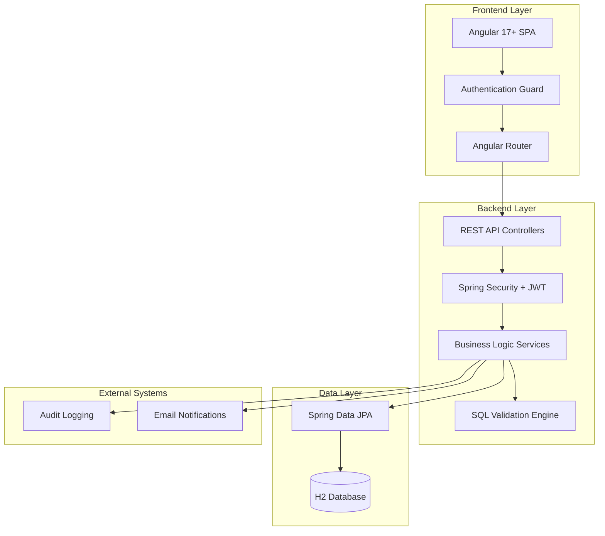
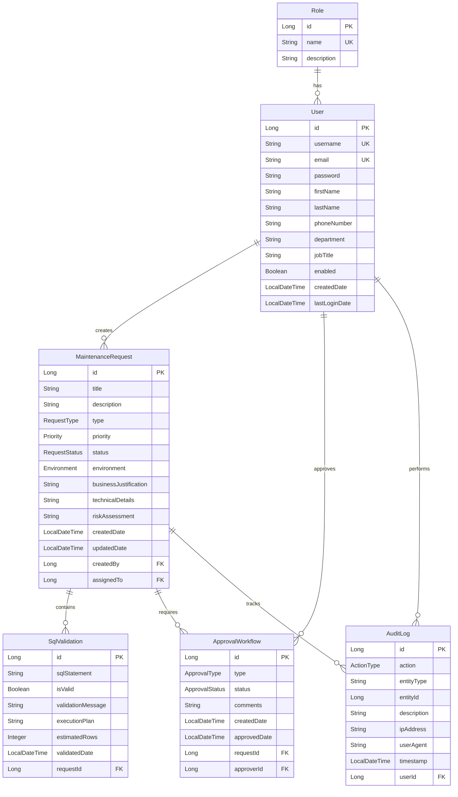
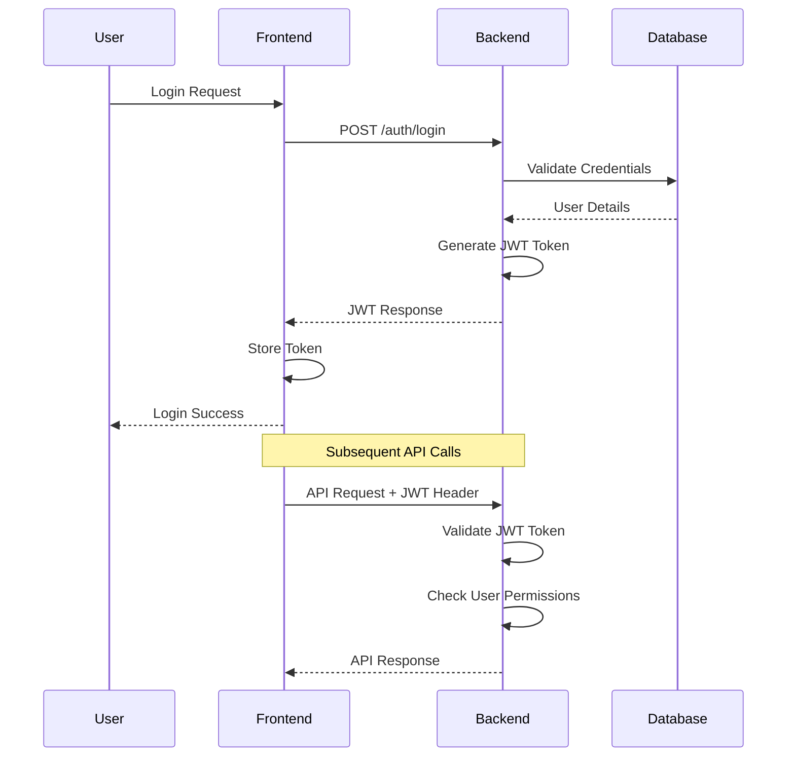
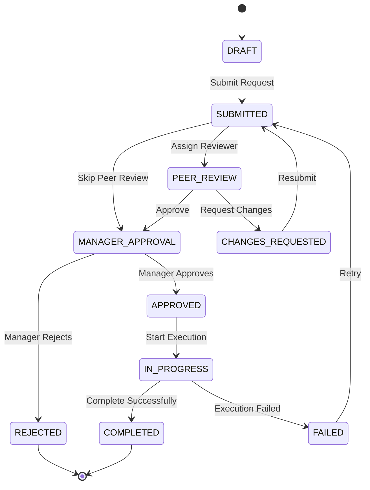

# Application Maintenance Workflow - System Architecture

## 🏗️ System Overview

The Application Maintenance Workflow is a full-stack web application designed to streamline maintenance operations with automated validation, approval workflows, and comprehensive audit trails. The system follows a modern microservices-inspired architecture with clear separation of concerns.

## 📐 High-Level Architecture



## 🎯 Design Principles

### 1. **Separation of Concerns**
- **Presentation Layer**: Angular components handle UI/UX
- **Business Logic Layer**: Spring services manage core functionality
- **Data Access Layer**: JPA repositories handle database operations
- **Security Layer**: JWT and Spring Security manage authentication/authorization

### 2. **RESTful API Design**
- Stateless communication between frontend and backend
- Standard HTTP methods and status codes
- JSON data exchange format
- Resource-based URL structure

### 3. **Role-Based Security**
- JWT token-based authentication
- Fine-grained role-based access control
- Method-level security annotations
- Route guards for frontend protection

### 4. **Audit Trail**
- Comprehensive logging of all system activities
- User action tracking with timestamps
- Change history for all entities
- Compliance and governance support

## 🏛️ Backend Architecture

### Spring Boot Application Structure

```
com.iris.maintenance/
├── config/                 # Configuration Classes
│   ├── SecurityConfig      # Spring Security configuration
│   └── DataInitializer     # Database initialization
├── controller/             # REST API Controllers
│   ├── AuthController      # Authentication endpoints
│   ├── MaintenanceRequestController
│   ├── SqlValidationController
│   └── ApprovalController
├── service/                # Business Logic Services
│   ├── UserService         # User management
│   ├── MaintenanceRequestService
│   ├── SqlValidationService
│   ├── ApprovalService
│   └── AuditService
├── repository/             # Data Access Layer
│   ├── UserRepository
│   ├── MaintenanceRequestRepository
│   ├── SqlValidationRepository
│   ├── ApprovalWorkflowRepository
│   └── AuditLogRepository
├── entity/                 # JPA Entities
│   ├── User
│   ├── Role
│   ├── MaintenanceRequest
│   ├── SqlValidation
│   ├── ApprovalWorkflow
│   └── AuditLog
├── dto/                    # Data Transfer Objects
│   ├── LoginRequest
│   ├── JwtResponse
│   ├── MaintenanceRequestDto
│   └── SqlValidationRequest
└── security/               # Security Components
    ├── JwtTokenProvider
    ├── JwtAuthenticationFilter
    └── JwtAuthenticationEntryPoint
```

### Key Backend Components

#### 1. **Authentication & Authorization**
```java
@Configuration
@EnableWebSecurity
@EnableMethodSecurity(prePostEnabled = true)
public class SecurityConfig {
    // JWT-based security configuration
    // Role-based access control
    // CORS configuration
}
```

#### 2. **SQL Validation Engine**
```java
@Service
public class SqlValidationService {
    // SQL syntax validation
    // Dry-run execution
    // Security checks for dangerous operations
    // Result formatting and logging
}
```

#### 3. **Approval Workflow Engine**
```java
@Service
public class ApprovalService {
    // Multi-level approval process
    // Workflow state management
    // Notification handling
    // Escalation logic
}
```

## 🎨 Frontend Architecture

### Angular Application Structure

```
src/app/
├── core/                   # Core Module (Singleton Services)
│   ├── guards/
│   │   └── auth.guard.ts   # Route protection
│   ├── interceptors/
│   │   └── auth.interceptor.ts  # JWT token injection
│   └── services/
│       ├── auth.service.ts      # Authentication service
│       └── maintenance-request.service.ts
├── features/               # Feature Modules
│   ├── auth/
│   │   └── login/          # Login component
│   ├── dashboard/          # Dashboard components
│   ├── requests/           # Request management
│   │   ├── request-form/
│   │   ├── request-list/
│   │   ├── request-detail/
│   │   ├── my-requests/
│   │   └── pending-approvals/
│   └── admin/              # Admin components
│       ├── admin-dashboard/
│       ├── user-management/
│       └── audit-logs/
└── shared/                 # Shared Components & Utilities
    ├── components/
    ├── pipes/
    └── models/
```

### Key Frontend Components

#### 1. **Authentication Service**
```typescript
@Injectable({ providedIn: 'root' })
export class AuthService {
  // JWT token management
  // User authentication state
  // Role-based access checking
  // Automatic token refresh
}
```

#### 2. **Route Guards**
```typescript
@Injectable({ providedIn: 'root' })
export class AuthGuard implements CanActivate {
  // Route protection based on authentication
  // Role-based route access control
  // Redirect to login for unauthorized access
}
```

#### 3. **HTTP Interceptors**
```typescript
@Injectable()
export class AuthInterceptor implements HttpInterceptor {
  // Automatic JWT token injection
  // Request/response logging
  // Error handling and token refresh
}
```

## 🗄️ Database Architecture

### Entity Relationship Diagram



### Database Design Principles

#### 1. **Normalization**
- Third Normal Form (3NF) compliance
- Elimination of data redundancy
- Referential integrity constraints
- Optimized for both read and write operations

#### 2. **Audit Trail**
- Complete activity logging
- Immutable audit records
- User action tracking
- Compliance support

#### 3. **Soft Deletes**
- Logical deletion for important entities
- Data retention for audit purposes
- Recovery capabilities

## 🔐 Security Architecture

### Authentication Flow



### Authorization Levels

#### 1. **Method-Level Security**
```java
@PreAuthorize("hasRole('ADMIN')")
@GetMapping("/admin/users")
public ResponseEntity<List<User>> getAllUsers() {
    // Admin-only endpoint
}

@PreAuthorize("hasRole('MANAGER') or hasRole('ADMIN')")
@PostMapping("/approvals/{id}/approve")
public ResponseEntity<?> approveRequest(@PathVariable Long id) {
    // Manager or Admin approval
}
```

#### 2. **Route-Level Security**
```typescript
{
  path: 'admin',
  canActivate: [AuthGuard],
  data: { roles: ['ADMIN'] },
  loadChildren: () => import('./admin/admin.module').then(m => m.AdminModule)
}
```

## 🔄 Workflow Engine Architecture

### Request Lifecycle State Machine



### Approval Workflow Components

#### 1. **Workflow Engine**
```java
@Service
public class ApprovalService {
    public void processApproval(Long requestId, ApprovalDecision decision) {
        // State transition logic
        // Notification handling
        // Audit logging
        // Next step determination
    }
}
```

#### 2. **State Management**
```java
public enum RequestStatus {
    DRAFT, SUBMITTED, PEER_REVIEW, CHANGES_REQUESTED,
    MANAGER_APPROVAL, APPROVED, REJECTED, IN_PROGRESS,
    COMPLETED, FAILED
}
```

## 📊 Performance Considerations

### Backend Optimizations

#### 1. **Database Optimization**
- Proper indexing on frequently queried columns
- Connection pooling configuration
- Query optimization with JPA criteria API
- Lazy loading for related entities

#### 2. **Caching Strategy**
```java
@Cacheable("users")
public User findByUsername(String username) {
    // Cached user lookup
}

@CacheEvict(value = "users", key = "#user.username")
public User updateUser(User user) {
    // Cache invalidation on update
}
```

### Frontend Optimizations

#### 1. **Lazy Loading**
```typescript
const routes: Routes = [
  {
    path: 'admin',
    loadChildren: () => import('./admin/admin.module').then(m => m.AdminModule)
  }
];
```

#### 2. **OnPush Change Detection**
```typescript
@Component({
  changeDetection: ChangeDetectionStrategy.OnPush
})
export class OptimizedComponent {
  // Optimized change detection
}
```

## 🔍 Monitoring & Observability

### Logging Strategy

#### 1. **Structured Logging**
```java
@Slf4j
@Service
public class MaintenanceRequestService {
    public MaintenanceRequest createRequest(MaintenanceRequestDto dto) {
        log.info("Creating maintenance request: title={}, type={}, user={}", 
                dto.getTitle(), dto.getType(), getCurrentUser().getUsername());
        // Service logic
    }
}
```

#### 2. **Audit Logging**
```java
@EventListener
public void handleUserAction(UserActionEvent event) {
    auditService.logAction(
        event.getAction(),
        event.getEntityType(),
        event.getEntityId(),
        event.getDescription(),
        event.getUser()
    );
}
```

### Health Checks

#### 1. **Spring Boot Actuator**
```properties
management.endpoints.web.exposure.include=health,info,metrics
management.endpoint.health.show-details=when-authorized
```

#### 2. **Custom Health Indicators**
```java
@Component
public class DatabaseHealthIndicator implements HealthIndicator {
    @Override
    public Health health() {
        // Custom health check logic
    }
}
```

## 🚀 Deployment Architecture

### Development Environment
```
┌─────────────────┐    ┌─────────────────┐
│   Angular Dev   │    │  Spring Boot    │
│   Server        │    │   Application   │
│   (ng serve)    │◄──►│   (embedded     │
│   Port: 4200    │    │    Tomcat)      │
└─────────────────┘    │   Port: 8080    │
                       └─────────────────┘
                                │
                       ┌─────────────────┐
                       │   H2 Database   │
                       │   (in-memory)   │
                       └─────────────────┘
```

### Production Environment
```
┌─────────────────┐    ┌─────────────────┐    ┌─────────────────┐
│   Web Server    │    │  Application    │    │   Database      │
│   (Nginx)       │    │    Server       │    │   (PostgreSQL/  │
│   Static Files  │◄──►│   (Spring Boot  │◄──►│    MySQL)       │
│   Port: 80/443  │    │    JAR)         │    │   Port: 5432    │
└─────────────────┘    │   Port: 8080    │    └─────────────────┘
                       └─────────────────┘
```

## 📈 Scalability Considerations

### Horizontal Scaling
- Stateless application design
- Load balancer configuration
- Session management with JWT tokens
- Database connection pooling

### Vertical Scaling
- JVM tuning parameters
- Memory optimization
- CPU utilization monitoring
- Database performance tuning

---

This architecture document provides a comprehensive overview of the Application Maintenance Workflow system design, covering all major components, patterns, and considerations for development, deployment, and maintenance.
